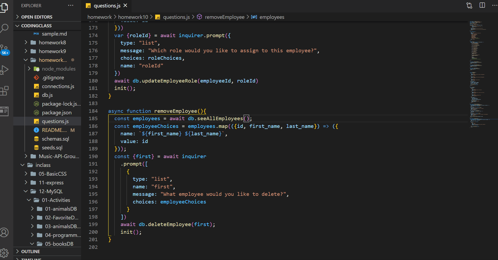

# Test
  

## Description

Command-line application that at allows the user to:

  * Add departments, roles, employees

  * View departments, roles, employees

  * Update employee roles

## Table of Contents

* [installation](#installation)
* [usage](#usage)
* [license](#license)
* [contributing](#contributing)
* [test](#tests)
* [questions](#questions)

To install necessary dependencies run the following command

npm install

## Usage

Open the terminal and type node question.js to start the application.

## License
      
      This project is licensed under the MIT license.

## Contributing

N/A

## Tests
To run test run the following command:
'''
npm test
'''

## How the application works

## Questions
If you have any questions about the repo contact me directly at c.trahan94@yahoo.com.
You can find more of my work at [ctrahan94](https://github.com/ctrahan94).

